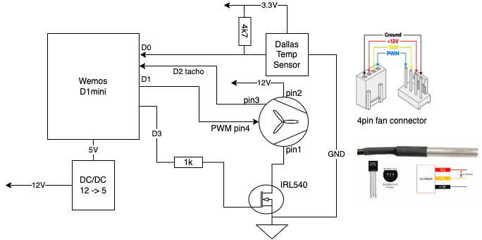
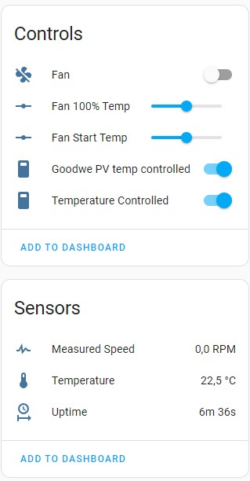

# esphome-fan-controller
Yet another esphome based fan controller. Can be controlled either manually or by DS18 temperature sensor, or by input from Home Assistant temperature sensor.

It works with a simple d1mini pro and 4pin controlled fans which can be controlled via PWM.

As additional feature switching off the fans completely via a N-Ch MOSFET is supported as most of the 
fans still run at minimum speed even if the pwm is at 0% duty cycle.

# Wiring
As you can see from the yaml, D0 is used for the temp sensor (yellow data line).
D1 drives the PWM output for speed controll of the fans.
D2 is the tacho input for measuring rotation speed.
D3 drives the MOSFET that can switch the fans off.

# Bill of materials
- Wemos D1 mini ESP8266, flashed with [ESPhome](https://esphome.github.io/esp-web-tools/).
- 12v buck converter to get to 5v, ie LM2596
- resistors 1K, 4.7K
- 4-pin fan(s) + 4-pin male connector(s)
- optional: DS18 temp sensor. Can easily incorporate a DHT or leverage temp sensors already available in Home assistant
- optional: mosfet transistor IRL540-N-Ch
# Notes
## power supply / fan type
I use 12V fans which requires to use some DC-DC converter down to 5V for the d1mini. 
## level shifting
My fans have no problem with PWM from the esp8266 being only at 3.3V level.
Same is true for tacho input (anyway measured as "pulled to low").
## mosfet type
Use a ttl compatible type that is "good enough" at 3.3V gate source voltage like the IRL540-N-Ch.
I use a 1k resistor from esp output to gate.
## mosfet needed?
The MOSFET is optional. You can just leave it out. Depending on the fans you use they will still run with their
built in minimum speed when "off".
## 3pin fans?
Please use 4pin fans otherwise the speed control does not work.
## multipe fans?
just apply a one-to-X adapter to drive more fans (RPM measurement may will become inaccurate)
## fans stop unexpected
some fans require a minimum duty cycle in the pwm to run (in contrast to the desktop fans, that run even at 0% pwm).
This means that you new a minimum pwm duty cycle to start with. This is currenty not supported directly. Either change it 
in the code or post an issue.
# Controls
You can either control the speed manually from off to min rpm to max rpm (0 speed means off).
If you switch on temperature control the speed of the fans will be controlled by the temp sensor in a 
linear curve: fans will be switched on at "fan start temp" and will increase speed until the temp
reaches "100% temp" and stay at 100% of course as long as the temp does go down.

# Home Assistant
in home assistant it looks like this 
Additionally there will be a new sensor already defined in Home assitant which can drive the fan speed.

# Communication
Currently the code uses the native API to communicate, you can easily switch to MQTT if you like to.

# Other
The "code" (its just a piece of yaml) also has the usual stuff enabled, like some system sensors about uptime and wifi.

Also a regular webserver running on port 80 is included so that you can control the fans directly within the browser.

OTA updates are supported and it also features a restart button, if needed.

# Reference / Inspired by
- https://github.com/3ative/PWM-Fan-controller
- https://community.home-assistant.io/t/pwm-fan-controller/433316